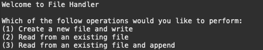
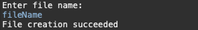
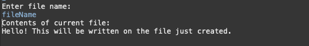
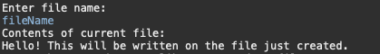

# File Handling

This program validates user inputted file name and can perform the following operations...

## Features

	- Creates file if file name does not already exists
	- Read from a newly created or existing file
	- Write to newly created or existing file
	- Append to newly created or existing file

## Installation

	- Clone and pull source code from provided github repository
	- Compile source code with Java Compiler
	- Run with Java Runtime Environment

## Code

	https://github.com/salabha77/File-Handling

## Usage
	Once run, the console will welcome and prompt the user for the operation that they want to perform.

User selects operation 1
	
	A prompt for a file name will appear, enter file name. If file name does not exists user will see 'File creation succeeded', otherwise if the file name exists 'File already exists'.

	A prompt for the data to be written will appear, enter the data to write. If write is successful user will see 'Write successful'.

User selects operation 2
	
	A prompt for a file name will appear, enter file name. If file name does not exists user will see 'File is not found', otherwise if the file name exists the current contents of the file will be output.
	

User selects operation 3

	A prompt for a file name will appear, enter file name. If file name does not exists user will see 'File is not found', otherwise if the file name exists the current contents of the file will be output.

	A prompt for the data to be appended will appear, enter the data to append. If append is successful user will see 'Append successful'.
